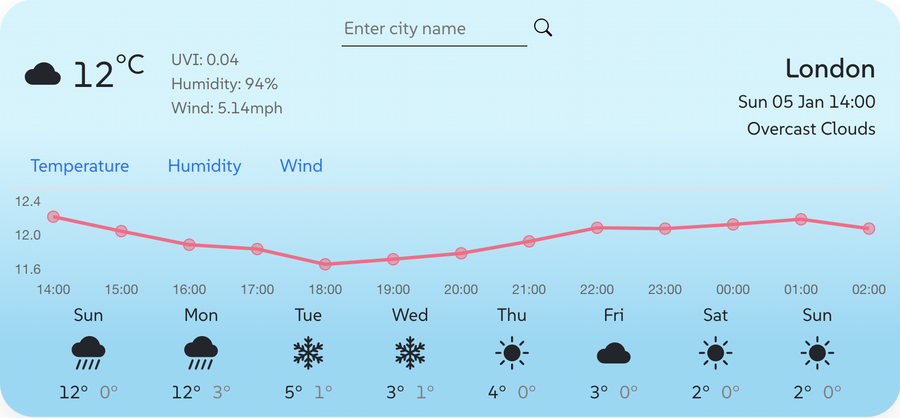

# Weather-Forecast-App Project
A Weather Forecast App that includes basic weather information for any city around the world.

Click this link for a live demo: [Weather-Forecast-App](https://main.d2c22tdmmbzffb.amplifyapp.com)

## Overview
**Tech used:** React.js, Chart.js, Javascript, HTML, CSS, Bootstrap

This Weather-Forecast-App allows users to get the weather forecast for any city around the world. The features include current date and time, current temperature and other information (UVI, humidity, wind), hourly forecasts (temperature, humidity, wind) and a weekly temperature forecast. The hourly forecasts are displayed visually through line charts and bar charts using Chart.js for improved UX. The original weather icons from the API have been replaced with Bootstrap icons for improved UI.

## Lessons Learned
- Use React Router for page routing.
- `<Link>` is used to set the URL and keep track of browsing history.
- Anytime we link to an internal path, use `<Link>` instead of `<a href="">`.
- Use `useRef()` hook to store a mutable value that does not cause a re-render when updated. When typing the city into the input element, the `useState()` hook was re-rendering after each letter typed. The `useRef()` hook prevented this infinite loop from happening and allowed for the render to happen **after** the input is submitted.

## API Usage
This Weather-Forecast-App uses the OpenWeatherMap API to get the current weather. OpenWeatherMap API is free to use for smaller-scale applications. The free tier allows for 60 calls/minute, Basic Weather Maps, Air Pollution API, Geocoding API, Weather Widgets and 95% availability.